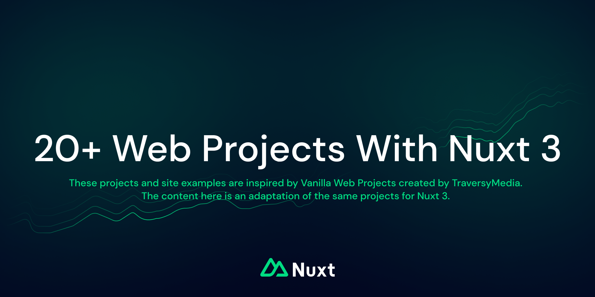

> This repository using [Nuxt 3](https://github.com/nuxt/nuxt), [Vue 3](https://github.com/vuejs/core), [Image Module](https://v1.image.nuxtjs.org), [Nuxt Fonts](https://github.com/nuxt/fonts), [VueUse](https://github.com/vueuse/vueuse)

These projects and site examples are inspired by Vanilla Web Projects created by [TraversyMedia](https://www.traversymedia.com/). The content here is an adaptation of the same projects for Nuxt 3. 

I think it is important to keep the projects faithful to the original, because I am not the real creator. But if you have a better structure or solution that fits Nuxt 3 or Vue 3, you can contribute without changing the purpose of the projects.

- [Original Vanilla Web Projects](https://vanillawebprojects.com/)
- [Original Github Repository](https://github.com/bradtraversy/vanillawebprojects)

